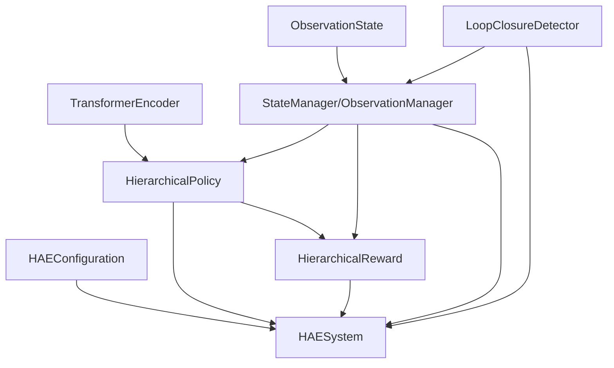

# HAE Hierarchical Attention-based Explorer System Architecture

## System Overview

HAE (Hierarchical Attention-based Explorer) is a perception-driven UAV exploration system designed for GPS-denied environments. The system uses LiDAR as the primary sensor and builds a "high-level sequential decision - low-level immediate execution" hierarchical architecture, making decisions directly within the observation space while reducing dependence on global state estimation to achieve autonomous exploration.

---

## System Architecture

### Overall Architecture Diagram

```
┌─────────────────────────────────────────────────────────────────┐
│              HAE Hierarchical Attention-based Explorer          │
├─────────────────────────────────────────────────────────────────┤
│                  Perception Layer (Local Map Maintenance)       │
│  LiDAR Point Cloud → Temporal Observation Anchor →              │
│  Local Grid → Structured Observation                            │
├─────────────────────────────────────────────────────────────────┤
│                  Decision Layer (Hierarchical Policy)           │
│  High-Level Policy:                                             │
│  Transformer Encoding K=20 History → T=5 (ψ,d) Subgoal Sequence │
│  Low-Level Policy: Observation + Subgoal →                      │ 
│  3D Velocity Control + Adaptive Constraints                     │
├─────────────────────────────────────────────────────────────────┤
│                  Learning Layer (Hierarchical Reward)           │
│  Topological Discovery Reward + Geometric Smoothness Penalty →  │ 
│  Joint Optimization                                             │
└─────────────────────────────────────────────────────────────────┘
```

### Hierarchical Division

#### Perception Layer: Local Map Maintenance (StateManager)
- **Input**: LiDAR point cloud data + odometry information
- **Output**: 64×64 local occupancy grid + temporal observation anchor
- **Core Functions**: Sliding window smoothing, neural loop closure detection, local geometric consistency maintenance

#### Decision Layer: Hierarchical Policy Network (HierarchicalPolicy)
- **High-Level Policy**: Based on Transformer encoding K=20 historical sequences, generates T=5 (ψ,d) subgoal sequences
- **Low-Level Policy**: Based on current observation + subgoals, outputs 3D velocity control (vx,vy,vz)
- **Safety Constraints**: Environment-adaptive velocity limitation mechanism

#### Learning Layer: Hierarchical Reward Mechanism (HierarchicalRolloutBuffer)
- **Topological Exploration**: Logarithmic differential reward to promote new area discovery
- **Geometric Smoothness**: Curvature penalty to reduce high-curvature trajectories
- **Adaptive Weights**: Dynamic reward weight adjustment based on exploration progress

### Data Closed-Loop Flow

```
LiDAR Point Cloud → Temporal Observation Anchor → Local Occupancy Grid → Observation Sequence Encoding
     ↑                                                                            ↓
Environment Execution ← 3D Velocity Control ← Adaptive Constraints ← Subgoal Sequence ← Transformer Encoding
```

---

## Core Module Details

### 1. StateManager.py - Observation Space State Management

#### Core Class: Observation State Representation
```python
@dataclass  
class ObservationState:
    # LiDAR Perception
    local_occupancy_grid: np.ndarray     # [64,64] local occupancy grid
    lidar_ranges: List[float]            # LiDAR range measurements
    
    # Temporal Information
    action_history: List[List[float]]    # historical action sequence
    observation_sequence: List[np.ndarray] # observation sequence cache
    
    # Subgoal Management
    subgoal_sequence: List[Tuple[float, float]]  # (ψ,d) subgoal sequence
    current_subgoal_index: int           # current executing subgoal index
```

#### Core Class: Temporal Observation Anchor (TOA)
```python
class TemporalObservationAnchor:
    def __init__(self, window_size=10, alpha=0.9):
        self.window_size = window_size
        self.alpha = alpha
        self.anchor_position = (0.0, 0.0, 0.0)  # (x, y, θ)
    
    def update_anchor(self, current_pose):
        """Sliding window smoothing anchor update"""
        # Exponential moving average update
        self.anchor_position = self.alpha * self.anchor_position + (1-self.alpha) * mean_pose
        
    def transform_to_anchor_frame(self, lidar_points):
        """Transform LiDAR point cloud to anchor coordinate frame"""
        # Geometric transformation, no global coordinate estimation involved
        return transformed_points
```

#### Local Map Construction Process

**Observation Anchor Update**
```python
# Temporal Observation Anchor (TOA) update
C_t = α × C_{t-1} + (1-α) × mean(recent_poses)  # α=0.9

# LiDAR point cloud transformation to anchor coordinate system
transformed_points = rotation_matrix @ (raw_points - C_t.position)
```

**Occupancy Grid Generation**
- Spatial resolution: 0.1m
- Coverage range: 6.4m × 6.4m  
- Grid dimensions: 64 × 64
- Ray casting: Bresenham algorithm marking occupied/free/unknown

**Neural Loop Closure Detection**
- Detection frequency: Every M=20 steps
- Feature extraction: CNN → 256-dim feature vector
- Similarity computation: Cross-attention mechanism
- Threshold decision: P_{t,j} > 0.8 triggers ICP alignment

### 2. HA_Modules.py - Transformer Encoding Core Components

#### Network Architecture Overview
```
┌──────────────────────────────────────────────────────────────┐
│                      HAE Transformer Components              │
├──────────────────────────────────────────────────────────────┤
│  Sequence Encoders:                                          │
│  • PositionalEncoding     - Temporal positional encoding     │
│  • TransformerEncoder                                        │
│                - Multi-head self-attention sequence encoding │
├──────────────────────────────────────────────────────────────┤
│  Perception Encoders:                                        │
│  • StateEncoder           - Unified state encoding           │
│  • HighLevelPerceptionEncoder                                │
│                - High-level historical sequence encoding     │
│  • LowLevelPerceptionEncoder                                 │
│                - Low-level immediate state encoding          │
├──────────────────────────────────────────────────────────────┤
│  Policy Networks:                                            │
│  • HighLevelActor         - Subgoal sequence generation      │
│  • LowLevelActorWithYawControl - 4D control output           │
├──────────────────────────────────────────────────────────────┤
│  Value Networks:                                             │
│  • HighLevelCritic        - High-level value estimation      │
│  • LowLevelCritic         - Low-level value estimation       │
└──────────────────────────────────────────────────────────────┘
```

#### Transformer Sequence Encoding

**Positional Encoding (PositionalEncoding)**
```python
PE(pos, 2i) = sin(pos / 10000^(2i/d_model))
PE(pos, 2i+1) = cos(pos / 10000^(2i/d_model))
```

**Multi-Head Self-Attention**
- Number of heads: 8 attention heads
- Hidden dimension: 256
- Sequence length: K=20 steps of historical observations
- Dropout: 0.1 to prevent overfitting

**Subgoal Sequence Generation**
```python
# High-level policy outputs T=5 step subgoals
ψ_{t+i} = tanh(MLP_yaw(E^HL)) × π        # heading angle ∈ [-π,π]
d_{t+i} = sigmoid(MLP_dist(E^HL)) × d_max # distance ∈ [0,d_max]
```

### 3. HierarchicalPolicy.py - Observation-Driven Hierarchical Decision Making

#### Core Architecture
```python
class HierarchicalPolicyNetwork(nn.Module):
    def __init__(self, observation_space, action_space):
        # Observation space management
        self.observation_manager = ObservationManager()
        
        # Transformer encoding components
        self.sequence_encoder = TransformerEncoder(d_model=256, nhead=8, num_layers=4)
        self.high_level_policy = HighLevelPolicy(input_dim=256, output_dim=10)  # T=5 steps×2 dim
        self.low_level_policy = LowLevelPolicy(input_dim=64+10, output_dim=3)   # 3D velocity
        
        # Adaptive safety constraints
        self.velocity_constraint = AdaptiveVelocityConstraint(v_max=1.0, d_threshold=3.0)
```

#### Observation-Driven Decision Process
```
1. Observation Input → ObservationManager.parse_observation()
2. Sequence Encoding → TransformerEncoder(observation_sequence[t-K:t])  
3. High-Level Decision → HighLevelPolicy → 5×2 subgoal sequence(ψ,d)
4. Low-Level Execution → LowLevelPolicy(current_obs, current_subgoal) → 3D velocity
5. Safety Constraints → AdaptiveVelocityConstraint → final control command
```

#### Multi-Step Subgoal Sequence
- **Temporal Consistency**: T=5 step lookahead subgoals avoid single-step decision oscillations
- **Decoupled Design**: Heading angle ψ and distance d generated by independent branches, reducing interference  
- **Constraint Mechanism**: tanh activation ensures angle range, sigmoid ensures distance non-negativity

#### Environment-Adaptive Velocity Constraints
```python
def adaptive_velocity_constraint(action, min_lidar_range):
    """Environment-adaptive velocity constraint mechanism"""
    v_scale = min(min_lidar_range / d_threshold, 1.0)  # d_threshold=3.0m
    constrained_action = torch.clamp(action, -v_max * v_scale, v_max * v_scale)
    return constrained_action
```

- **Passive Safety**: Automatically reduces velocity when approaching obstacles
- **Open Area Recovery**: Restores maximum velocity when away from obstacles
- **Smooth Transitions**: Linear interpolation avoids velocity jumps

### 4. HierarchicalRolloutBuffer.py - Hierarchical Exploration Experience Management

#### Hierarchical Reward Mechanism
```python
class HierarchicalReward:
    def __init__(self):
        self.topological_weight = AdaptiveWeight()  # Topological exploration weight
        self.geometric_weight = AdaptiveWeight()    # Geometric smoothness weight
    
    def compute_high_level_reward(self, coverage_gain, trajectory_curvature):
        """High-level reward: Topological discovery + Geometric smoothness"""
        topological_reward = log(1 + coverage_gain / c_0)  # Logarithmic gain
        geometric_penalty = -mean([κ_i^2 for κ_i in curvatures])  # Curvature penalty
        
        return self.topological_weight * topological_reward + self.geometric_weight * geometric_penalty
    
    def compute_low_level_reward(self, velocity, deviation, safety_factor, collision):
        """Low-level reward: Execution efficiency + Safety"""
        efficiency = velocity * cos(deviation) * safety_factor
        safety_penalty = -λ * collision  # λ=5.0
        
        return efficiency + safety_penalty
```

#### Exploration Evaluation Metrics
```python
# Relative coverage ratio
η_rel = |explored_cells| / max(|explored_cells_across_runs|)

# Topological completeness  
τ = N_explored_components / N_max_components

# Termination conditions
terminate_if(η_rel > 0.95 or collision_detected or t > T_max)
```

### 5. __init__.py - System Integration Layer

#### Configuration Management
```python
@dataclass
class HAEConfiguration:
    # Observation space configuration
    grid_resolution: float = 0.1        # Occupancy grid resolution (m)
    grid_size: Tuple[int, int] = (64, 64)  # Grid dimensions
    history_length: int = 20            # Historical observation length K
    
    # Hierarchical decision configuration  
    subgoal_horizon: int = 5            # Subgoal lookahead steps T
    update_frequency: int = 5           # High-level update frequency τ
    
    # Transformer configuration
    d_model: int = 256                  # Model dimension
    nhead: int = 8                      # Number of attention heads
    num_layers: int = 4                 # Number of encoder layers
    
    # Safety constraint configuration
    v_max: float = 1.0                  # Maximum velocity (m/s)
    d_threshold: float = 3.0            # Distance threshold (m)
    
    # Loop closure detection configuration
    loop_detection_freq: int = 20       # Detection frequency M
    similarity_threshold: float = 0.8   # Similarity threshold
```

#### Core System Manager
```python
class HAESystem:
    def __init__(self, config: HAEConfiguration):
        self.config = config
        
        # Core component initialization
        self.observation_manager = ObservationManager(config)
        self.transformer_encoder = TransformerEncoder(config)
        self.hierarchical_policy = HierarchicalPolicy(config)
        self.reward_mechanism = HierarchicalReward(config)
        self.loop_detector = LoopClosureDetector(config)
        
    def step(self, observation):
        """Single-step decision execution"""
        # Observation processing
        parsed_obs = self.observation_manager.parse(observation)
        
        # Hierarchical decision making
        if self.should_update_high_level():
            subgoal_sequence = self.hierarchical_policy.high_level_step(parsed_obs)
        
        action = self.hierarchical_policy.low_level_step(parsed_obs, current_subgoal)
        
        # Safety constraints
        safe_action = self.apply_velocity_constraint(action, parsed_obs.min_lidar_range)
        
        return safe_action
```

---

## Training Mechanism

### Hierarchical Reward Optimization

#### High-Level Reward: Topological Exploration + Geometric Smoothness
```
r_t^H = w_t^τ × Δφ_t + w_t^γ × r_t^γ

Where:
• Δφ_t = log(1 + c_t/c_0) - log(1 + c_{t-1}/c_0)  # Topological gain
• r_t^γ = -1/(T-1) × Σ κ_i^2                      # Curvature penalty
• w_t^τ = 1/(1 + n_t^c), w_t^γ = 1/(1 + n_t^{col}) # Adaptive weights
```

#### Low-Level Reward: Execution Efficiency + Safety
```
r_t^L = v_t × cos(δ_t) × s_t - λ × c_t

Where:
• v_t: velocity magnitude
• δ_t: angular deviation from subgoal direction  
• s_t: safety factor I[min_lidar_range > 0.5m]
• c_t: collision indicator
• λ = 5.0: collision penalty weight
```

### Exploration Performance Evaluation

#### Coverage Metrics
```python
# Relative coverage ratio
η_rel = |C_t| / max_{k∈R} |C_k|

# Topological completeness
τ = N_explored^comp / N_max^comp

# Termination conditions
terminate_if(η_rel > 0.95 or collision or t >= T_max)
```

#### Training Algorithm Flow
```
1. Observation sequence collection → Temporal observation anchor update
2. Hierarchical decision execution → Subgoal sequence generation → 3D velocity control  
3. Environment interaction → New observation acquisition → Loop closure detection
4. Hierarchical reward computation → Advantage estimation → Policy gradient update
5. Model parameter synchronization → Experience buffer update
```

---

## Working Theory

### Observation-Driven Exploration Principles

**Temporal Consistency Modeling**: Through sliding window smoothing of the Temporal Observation Anchor (TOA), constructs short-term geometrically consistent observation representations, avoiding interference from instantaneous noise on decision making.

**Multi-Step Lookahead Decision**: High-level policy outputs T=5 step subgoal sequences, providing temporally coherent navigation intent for low-level control, reducing trajectory oscillations caused by single-step decisions.

**Loop Closure Consistency Maintenance**: Neural network loop closure detection combined with ICP alignment suppresses drift accumulation at the observation scale, maintaining temporal consistency of local geometric structures.

### Hierarchical Abstraction Mechanisms

**Temporal Scale Separation**: High-level policy focuses on long-term exploration strategies (K=20 step history), while low-level policy specializes in immediate safety control, achieving division of labor across different temporal scales.

**Spatial Abstraction Separation**: High-level decisions based on topological connectivity and coverage completeness, low-level control based on geometric distances and collision avoidance, handling different abstraction levels of space separately.

**Goal Decomposition Principle**: Complex exploration tasks are decomposed into heading-distance (ψ,d) subgoal sequences, providing intermediate representations for navigation decisions and simplifying learning complexity.

### Adaptive Safety Mechanisms

**Environment-Responsive Constraints**: Velocity limits adaptively adjust based on nearest obstacle distance, maximizing exploration efficiency while ensuring safety.

**Passive Safety Design**: Does not rely on active obstacle prediction, passively adjusting behavior through environment feedback distance information, improving robustness.

**Smooth Constraint Transitions**: Linear interpolation velocity constraints avoid control output jumps, ensuring system stability and flight smoothness.

---

## Module Dependencies



### Core Dependency Chain
1. **ObservationState** → ObservationManager: Observation representation standardization
2. **TransformerEncoder** → HierarchicalPolicy: Sequence encoding and hierarchical decision making
3. **LoopClosureDetector** → ObservationManager: Loop closure detection and map maintenance
4. **HierarchicalPolicy + ObservationManager** → HierarchicalReward: Decision execution and reward computation  
5. **All Components** → HAESystem: Unified system management

### Modular Design Principles
- End-to-end decision making within observation space, no global state dependencies
- Unidirectional data flow between components, avoiding circular dependencies
- Configuration-driven system integration, supporting flexible deployment
- Standardized interface design, facilitating independent testing and extension

---

## Summary

HAE (Hierarchical Attention-based Explorer) hierarchical attention-based exploration system achieves observation-driven end-to-end learning from LiDAR point cloud observations to 3D velocity control through organic integration of five core modules. The system embodies attention mechanisms and hierarchical thinking at three levels: observation representation, sequence encoding, and hierarchical decision making, providing a complete technical solution for autonomous UAV exploration in GPS-denied environments.

**Core Advantages**:
- **Observation-Driven**: Makes decisions entirely within observation space, reducing dependence on global state
- **Temporal Modeling**: Transformer encoding of historical observation sequences captures long-term temporal dependencies
- **Hierarchical Decision Making**: Multi-step subgoal sequences provide temporally coherent navigation intent
- **Local Consistency**: Sliding window smoothing and loop closure detection maintain short-term geometric consistency
- **Adaptive Safety**: Environment-responsive velocity constraint mechanisms ensure exploration safety

**Technical Innovations**:
- Pure observation-driven hierarchical exploration framework
- Local map maintenance mechanism with temporal observation anchors  
- Multi-step lookahead decision making based on Transformers
- Hierarchical reward design for topological discovery and geometric smoothness
- Integration of neural network loop closure detection with geometric alignment
