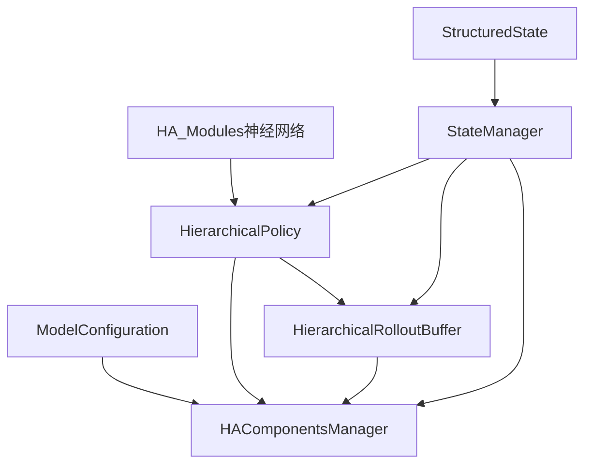

# HA-UAV 分层强化学习系统架构文档

## 系统定位

HA-UAV (Hierarchical Architecture for Unmanned Aerial Vehicle) 是一套面向室内低空场景的分层强化学习无人机避障系统。系统以360°激光雷达为唯一外感传感器，构建"高层决策-低层执行"双闭环架构，在观测、决策、训练三条主链路全部实现"雷达驱动、历史感知、零外部地图"的端到端闭环。

---

## 系统架构

### 总体架构图

```
┌─────────────────────────────────────────────────────────────────┐
│                       HA-UAV 分层强化学习系统                      │
├─────────────────────────────────────────────────────────────────┤
│                        感知层 (StateManager)                     │
│  86维雷达观测 → 状态解析 → 64维低层感知 + K×28维高层感知序列        │
├─────────────────────────────────────────────────────────────────┤
│                     决策层 (HierarchicalPolicy)                  │
│  高层策略 (τ=5步周期): K=20步历史 → T=5步(ψ,d)子目标序列           │
│  低层策略 (1步周期): 64维感知+子目标 → 4D控制(vx,vy,vz,yaw_rate)  │
├─────────────────────────────────────────────────────────────────┤
│                   学习层 (HierarchicalRolloutBuffer)             │
│  双层级经验存储 → 分层GAE估计 → PPO联合更新                       │
└─────────────────────────────────────────────────────────────────┘
```

### 层次划分

#### 感知层：StateManager 统一状态管理
- **输入**：86维激光雷达观测 + 历史信息
- **输出**：结构化状态表示 + 分层观测提取
- **核心功能**：观测解析、状态历史管理、决策周期控制

#### 决策层：HierarchicalPolicy 分层策略网络
- **高层策略**（τ=5步周期）：基于K=20步历史，生成T=5步(ψ,d)子目标序列
- **低层策略**（1步周期）：基于64维局部感知+当前子目标，输出4D控制命令
- **价值网络**：高层与低层独立critic，分别估计状态价值

#### 学习层：HierarchicalRolloutBuffer 分层经验管理
- **数据存储**：双层级经验缓冲，支持异步更新周期
- **优势估计**：分层GAE计算，不同权重分配
- **批量采样**：统一数据流水线，支持PPO联合训练

### 数据闭环流程

```
原始雷达扇区 → 运动-地图特征融合 → 高层上下文向量 → 子目标 
     ↑                                                    ↓
环境动力学 ← 4D控制 ← 低层上下文向量 ← 当前子目标
```

---

## 核心模块详解

### 1. StateManager.py - 统一状态管理中枢

#### 核心类：StructuredState
```python
@dataclass
class StructuredState:
    # 基础状态
    drone_position: List[float]          # 无人机位置
    drone_velocity: List[float]          # 无人机速度  
    drone_orientation: List[float]       # 无人机姿态
    target_position: List[float]         # 目标位置
    
    # 雷达驱动字段
    sector_distances: List[float]        # [36] 激光雷达扇区距离
    action_history: List[List[float]]    # [6,4] 历史动作序列
    subgoal_sequence: List[List[float]]  # [5,2] 子目标序列(ψ,d)
    
    # 地图状态
    local_map_features: List[float]      # [16] 局部地图特征
    parsed_map_state: Dict[str, float]   # 解析后地图状态
```

#### 核心类：StateManager
```python
class StateManager:
    def __init__(self, history_length=20, high_level_update_frequency=5, future_horizon=5)
    
    # 主要方法
    def parse_and_update(obs) → StructuredState        # 86维观测解析
    def extract_low_level_observation(obs) → Tensor    # 64维低层观测提取
    def extract_high_level_observation_sequence(obs, K=5) → Tensor  # K×28维高层序列
    def should_update_high_level() → bool              # 高层更新判断
    def update_subgoal_sequence(seq)                    # 子目标更新
```

#### 观测维度解析 (86维)
```
┌─────────────────┬────────┬─────────────────────────────────┐
│     区间        │  维度   │            语义含义              │
├─────────────────┼────────┼─────────────────────────────────┤
│    [0:36]       │   36   │ 激光雷达扇区距离，归一化至[0,1]   │
│   [36:60]       │   24   │ 最近6步动作历史(6×4维)           │
│   [60:70]       │   10   │ 当前生效5步(ψ,d)子目标序列       │
│   [70:86]       │   16   │ 局部地图统计特征                 │
└─────────────────┴────────┴─────────────────────────────────┘
```

#### 分层观测提取

**低层观测 (64维)**
```
扇区距离 36维 + 运动状态 12维 + 近期动作 8维 + 局部地图 8维 = 64维
```

**高层观测 (K×28维)**
```
每步28维 = 全局地图统计 16维 + 长期运动模式 8维 + 子目标执行状态 4维
```

### 2. HA_Modules.py - 神经网络核心组件

#### 网络架构概览
```
┌──────────────────────────────────────────────────────────────┐
│                      HA_Modules 神经网络组件                   │
├──────────────────────────────────────────────────────────────┤
│  基础组件:                                                    │
│  • PositionalEncoding     - Transformer位置编码               │
│  • TransformerEncoder     - 序列编码核心                      │
├──────────────────────────────────────────────────────────────┤
│  感知编码器:                                                  │
│  • StateEncoder           - 统一状态编码                      │
│  • HighLevelPerceptionEncoder  - 高层历史序列编码             │
│  • LowLevelPerceptionEncoder   - 低层即时状态编码             │
├──────────────────────────────────────────────────────────────┤
│  策略网络:                                                    │
│  • HighLevelActor         - 子目标序列生成                    │
│  • LowLevelActorWithYawControl - 4D控制输出                   │
├──────────────────────────────────────────────────────────────┤
│  价值网络:                                                    │
│  • HighLevelCritic        - 高层价值估计                      │
│  • LowLevelCritic         - 低层价值估计                      │
└──────────────────────────────────────────────────────────────┘
```

#### 核心网络维度映射
```python
# 感知编码器
StateEncoder:                  grid(K,32,32) + yaw(K,) → [K,256]
LowLevelStateEncoder:          obs(B,64) → [B,128] 
HighLevelPerceptionEncoder:    grid(K,8,8) + yaw(K,) → [B,256]
LowLevelPerceptionEncoder:     sector(B,36) + action(B,6,4) + subgoal(B,5,2) → [B,128]

# 策略网络  
HighLevelActor:                context(B,256) → subgoal(B,5,2)
LowLevelActorWithYawControl:   context(B,128) → action(B,4)

# 价值网络
HighLevelCritic:               context(B,256) → value(B,1)
LowLevelCritic:                context(B,128) → value(B,1)
```

#### Transformer架构设计

**位置编码 (PositionalEncoding)**
- 数学公式：`PE(pos,2i) = sin(pos/10000^(2i/d_model))`
- 功能：为序列数据提供位置信息，支持可变长度输入

**编码器层次**
- 高层：多头自注意力 + 前馈网络，处理K=20步历史序列
- 低层：轻量化Transformer，处理当前状态与子目标融合

### 3. HierarchicalPolicy.py - 分层策略网络

#### 核心架构
```python
class HierarchicalPolicyNetwork(nn.Module):
    def __init__(self, observation_space, action_space, features_dim=512):
        # 统一状态管理器
        self.state_manager = StateManager(history_length=20, high_level_update_frequency=5)
        
        # HA_Modules组件集成
        self.high_level_perception = HighLevelPerceptionEncoder(...)
        self.low_level_perception = LowLevelPerceptionEncoder(...)
        self.high_level_actor = HighLevelActor(...)
        self.low_level_actor = LowLevelActorWithYawControl(...)
        self.high_level_critic = HighLevelCritic(...)
        self.low_level_critic = LowLevelCritic(...)
```

#### 分层决策流程
```
1. 观测输入 (86维) → StateManager.parse_and_update()
2. 高层决策判断 → should_update_high_level() 
3a. 高层路径: 提取K×28序列 → HighLevelPerceptionEncoder → HighLevelActor → 5×2子目标
3b. 低层路径: 提取64维观测 → LowLevelPerceptionEncoder → LowLevelActor → 4D控制
4. 价值估计: 分别通过HighLevelCritic和LowLevelCritic
```

#### 策略输出约束
```python
# 高层策略输出
subgoals = torch.tanh(raw_subgoals) * torch.pi  # ψ ∈ [-π,π] 
distances = torch.sigmoid(raw_distances)        # d ∈ [0,1]

# 低层策略输出  
velocities = torch.tanh(raw_vel) * max_speed    # vx,vy,vz ∈ [-2,2] m/s
yaw_rate = torch.tanh(raw_yaw) * max_yaw_rate   # yaw_rate ∈ [-1,1] rad/s
```

### 4. HierarchicalRolloutBuffer.py - 分层经验管理

#### 数据结构定义
```python
class HierarchicalRolloutBufferSamples(NamedTuple):
    # 标准PPO数据
    observations: torch.Tensor           # [batch_size, 86] 原始观测
    actions: torch.Tensor               # [batch_size, 4] 执行动作
    old_values: torch.Tensor            # [batch_size] 旧价值估计
    advantages: torch.Tensor            # [batch_size] 优势估计
    
    # 分层扩展数据
    low_level_observations: torch.Tensor     # [batch_size, 64] 低层观测
    high_level_observations: torch.Tensor    # [batch_size, K, 28] 高层观测序列
    high_level_actions: torch.Tensor         # [batch_size, 10] 高层动作
    
    # 分层价值与优势
    high_level_values: torch.Tensor          # [batch_size] 高层价值
    low_level_values: torch.Tensor           # [batch_size] 低层价值
    high_level_advantages: torch.Tensor      # [batch_size] 高层优势
    low_level_advantages: torch.Tensor       # [batch_size] 低层优势
    
    # 更新掩码
    high_level_update_mask: torch.Tensor     # [batch_size] 高层更新掩码
    low_level_update_mask: torch.Tensor      # [batch_size] 低层更新掩码
```

#### 分层GAE计算
```python
def compute_returns_and_advantage(self):
    # 高层GAE (τ=5步更新)
    high_level_advantages = compute_gae_with_mask(
        rewards * 0.4,  # 权重0.4
        values=high_level_values,
        mask=high_level_update_mask
    )
    
    # 低层GAE (每步更新)  
    low_level_advantages = compute_gae_with_mask(
        rewards * 0.6,  # 权重0.6
        values=low_level_values,
        mask=low_level_update_mask  # 恒为True
    )
```

### 5. __init__.py - 系统集成层

#### 配置管理
```python
@dataclass
class ModelConfiguration:
    state_manager_config: Dict     # StateManager配置
    policy_config: Dict           # HierarchicalPolicy配置  
    buffer_config: Dict           # HierarchicalRolloutBuffer配置
    training_config: Dict         # 训练超参数配置
    env_config: Dict              # 环境配置
```

#### 组件管理器
```python
class HAComponentsManager:
    def __init__(self, config: ModelConfiguration):
        self.state_manager = StateManager(...)
        self.policy = HierarchicalPolicy(...)
        self.buffer = HierarchicalRolloutBuffer(...)
        
    def collect_rollout(env) → HierarchicalRolloutBuffer    # 经验收集
    def train_step(batch) → Dict[str, float]               # 训练步骤
    def save_model(path: str)                               # 模型保存
    def load_model(path: str)                               # 模型加载
```

#### 一键初始化接口
```python
def create_ha_system(env, config_path=None) -> HAComponentsManager:
    """一行代码初始化完整HA-UAV系统"""
    config = ModelConfiguration.load(config_path) if config_path else ModelConfiguration()
    return HAComponentsManager(config)
```

---

## 训练机制

### PPO联合目标函数
```
L_total = L_PPO_common + λ_hl × (L_hl_policy + 0.5 × L_hl_value) + λ_ll × (L_ll_policy + 0.5 × L_ll_value)

其中：
• λ_hl = λ_ll = 0.1 (层级加权系数)
• L_PPO_common: 标准PPO损失
• L_hl_*: 高层策略与价值损失
• L_ll_*: 低层策略与价值损失
```

### 分层GAE优势估计
```python
# 高层优势 (τ=5步更新)
A_hl = GAE(R_hl × 0.4, V_hl, mask=every_5_steps)

# 低层优势 (每步更新)  
A_ll = GAE(R_ll × 0.6, V_ll, mask=every_step)
```

### 训练数据流水线
```
1. Rollout收集 → StateManager观测解析 → 分层缓冲区存储
2. 分层GAE计算 → 优势估计 + 回报计算
3. 批量采样 → HierarchicalRolloutBufferSamples
4. 联合反向传播 → 梯度裁剪 → 参数同步
```

---

## 工作理论

### 分层抽象原理

**时间尺度分离**：高层策略在τ=5步时间尺度上进行抽象决策，低层策略在单步时间尺度上进行精细控制，实现了时间上的层次化分工。

**空间抽象分离**：高层感知基于K=20步长期历史序列，捕捉全局导航模式；低层感知基于64维即时状态，专注局部避障反应。

**目标分解原理**：复杂的长程导航任务被分解为5步子目标序列{(ψ,d)}，每个子目标包含方向角ψ和归一化距离d，提供了导航的中间表示。

### 感知融合机制

**多时间尺度感知**：通过Transformer编码器处理不同时间窗口的感知信息，高层编码器关注长期趋势，低层编码器关注即时反应。

**雷达-地图融合**：将激光雷达扇区距离与局部地图统计特征融合，实现传感器数据与空间认知的统一建模。

**历史-当前融合**：通过注意力机制将历史状态序列与当前观测融合，使策略能够利用历史经验指导当前决策。

### 学习优化理论

**分层价值分解**：将总价值函数分解为高层战略价值和低层战术价值，分别优化不同层次的决策质量。

**异步更新机制**：高层策略以1/5的频率更新，降低了高层决策的计算开销，同时保证了低层控制的实时性。

**经验重用策略**：通过分层缓冲区设计，高层经验可以在多个低层更新周期中重复利用，提高了样本效率。

---

## 模块依赖关系



### 核心依赖链
1. **StructuredState** → StateManager：状态表示标准化
2. **StateManager** → HierarchicalPolicy：观测解析与状态管理
3. **HA_Modules** → HierarchicalPolicy：神经网络组件集成
4. **HierarchicalPolicy + StateManager** → HierarchicalRolloutBuffer：经验数据生成
5. **All Components** → HAComponentsManager：统一组件管理

### 零重复设计原则
- 每个模块负责单一职责，无功能重叠
- 通过配置驱动的方式实现组件间协调
- 数据流向单向化，避免循环依赖
- 接口标准化，支持独立测试与替换

---

## 总结

HA-UAV分层强化学习系统通过六大核心模块的有机集成，实现了从86维雷达观测到4维控制输出的端到端学习。系统在观测抽象、决策分层、学习优化三个层面都体现了分层思想，为室内无人机自主导航提供了完整的技术方案。

**核心优势**：
- **统一数据流**：StateManager集中管理所有状态转换
- **分层决策**：时间与空间的双重抽象分离
- **模块化设计**：零代码重复，高内聚低耦合
- **训练高效**：分层GAE与PPO联合优化
- **部署友好**：一键初始化，配置驱动

**技术创新**：
- 纯雷达驱动的端到端学习框架
- 多时间尺度的Transformer感知编码
- 分层价值分解的优势估计机制
- 子目标序列的中间表示学习
